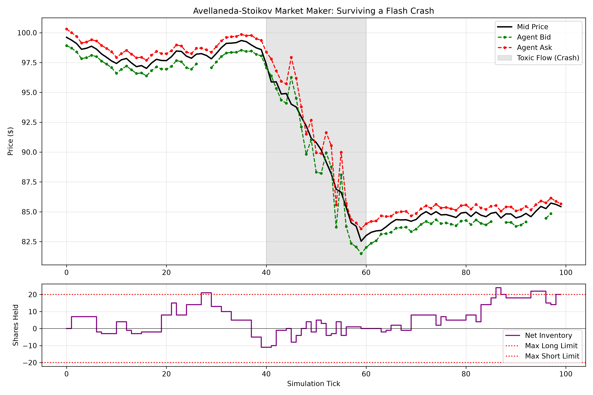

# Quantitative Market Making: Avellaneda-Stoikov Simulation

## Abstract
This repository implements a research-grade market-making simulator based on the Avellaneda-Stoikov (AS) model. The objective is to demonstrate how inventory-aware pricing and dynamic spread adjustments actively mitigate risk in adverse market conditions. By transitioning from theoretical math to applied microeconomics, the simulation proves that active risk management significantly truncates left-tail blowout risks during toxic directional market trends.

## Economic Mechanics & Architecture
Rather than relying on guaranteed fills or static variables, this model introduces real-world market imperfections:
* **Inventory Skew & Risk Aversion ($\gamma$):** The agent calculates a theoretical reservation price that skews away from the mid-price based on current inventory, actively mean-reverting its position.
* **Dynamic Volatility ($\sigma$):** Volatility is not treated as a static historical ledger entry. A rolling standard deviation dynamically updates $\sigma$, forcing the mathematical spread to widen automatically when market chaos spikes.
* **Probabilistic Liquidity:** Using an exponential Poisson process ($\exp(-k \cdot \delta)$), the simulation ensures quotes placed further from the mid-price face realistic rejection rates.
* **Hard Capital Constraints:** Built-in logic severs the quoting engine when maximum inventory thresholds are breached, ensuring the agent operates within strictly defined risk limits.

## Stress Testing & Microstructure Analysis
The agent was subjected to rigorous Monte Carlo stress tests to evaluate its performance under information asymmetry and toxic order flow. 

### The Flash Crash Scenario
In a simulated 20-tick aggressive directional trend (adverse selection), a naive, symmetric market maker would blindly buy the dip, accumulating a massive, devalued long position. 

This AS agent successfully:
1. Detected the toxic flow via spiking dynamic volatility.
2. Widened its bid-ask spread to demand higher compensation for risk.
3. Triggered its hard inventory limits to refuse catching the falling knife.

**Empirical Results (1,000 Iterations of Toxic Flow):**
* **Mean PnL:** $151.11 *(Maintained positive expected value)*
* **Maximum Simulated Loss:** -$74.34 *(Eliminated catastrophic left-tail risk)*


*Figure 1: Tick-by-tick microeconomic visualization of the agent dynamically widening spreads and severing bids during a simulated crash.*

## Technical Implementation
Built with Python and managed via `uv`, the simulation isolates the AS mathematical engine, performance logging, and market generation for clean extensibility.

**To run the baseline Monte Carlo:**
```bash
uv run python run_monte_carlo.py
